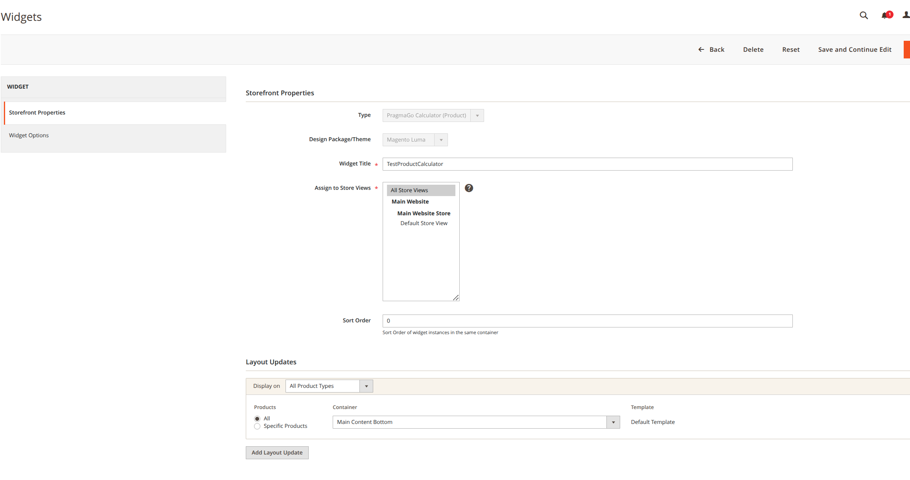

# Pragma_PragmaPayCalculator module

## Description

The `Pragma_PragmaPayCalculator` module provides widgets for displaying the PragmaGo calculator in Magento. These widgets allow merchants to integrate a calculator for deferred payments on product and cart pages. The module supports customization of widget settings and ensures seamless integration with the PragmaGo SDK.

## Installation details

For information about a module installation in Magento 2, see [Enable or disable modules](https://devdocs.magento.com/guides/v2.4/install-gde/install/cli/install-cli-subcommands-enable.html).

## Extensibility

Extension developers can interact with the `Pragma_PragmaPayCalculator` module. For more information about the Magento extension mechanism, see [Magento plug-ins](https://devdocs.magento.com/guides/v2.4/extension-dev-guide/plugins.html).

[The Magento dependency injection mechanism](https://devdocs.magento.com/guides/v2.4/extension-dev-guide/depend-inj.html) enables you to override the functionality of the `Pragma_PragmaPayCalculator` module.

## Widgets

The `Pragma_PragmaPayCalculator` module provides the following widgets:

### 1. PragmaGo Calculator (Product)

**Description:**
Displays the PragmaGo calculator on product pages using the product price.

**Settings:**
- **Product ID (optional):** Allows specifying a product ID to override the default product context.
- **Template:** Defines the template used for rendering the widget. The default template is `product_calculator.phtml`.

**How to Configure in Magento Admin Panel:**
1. Navigate to **Content > Widgets** in the Magento Admin Panel.
2. Click **Add Widget**.
3. Select **PragmaGo Calculator (Product)** as the widget type.
4. Choose the desired **Design Theme** and click **Continue**.
5. In the **Storefront Properties** tab:
   - Set the **Widget Title**.
   - Assign the widget to specific **Store Views**.
   - Define the **Sort Order**.
6. In the **Widget Options** tab:
   - Specify the **Product ID** (optional).
   - Select the **Template** (default: `product_calculator.phtml`).
7. Save the widget and clear the cache.

**Example Image:**

---

### 2. PragmaGo Calculator (Cart)

**Description:**
Displays the PragmaGo calculator on the cart page using the total cart value.

**Settings:**
- **Template:** Defines the template used for rendering the widget. The default template is `cart_calculator.phtml`.

**How to Configure in Magento Admin Panel:**
1. Navigate to **Content > Widgets** in the Magento Admin Panel.
2. Click **Add Widget**.
3. Select **PragmaGo Calculator (Cart)** as the widget type.
4. Choose the desired **Design Theme** and click **Continue**.
5. In the **Storefront Properties** tab:
   - Set the **Widget Title**.
   - Assign the widget to specific **Store Views**.
   - Define the **Sort Order**.
6. In the **Widget Options** tab:
   - Select the **Template** (default: `cart_calculator.phtml`).
7. Save the widget and clear the cache.

**Example Image:**

## Additional information

For information about significant changes in patch releases, see [Release information](https://devdocs.magento.com/guides/v2.4/release-notes/bk-release-notes.html).
