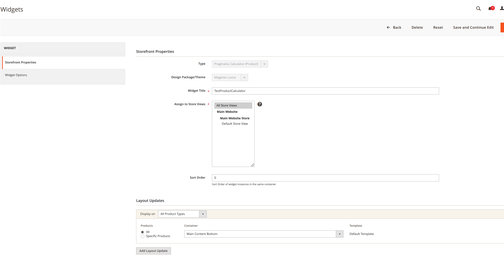
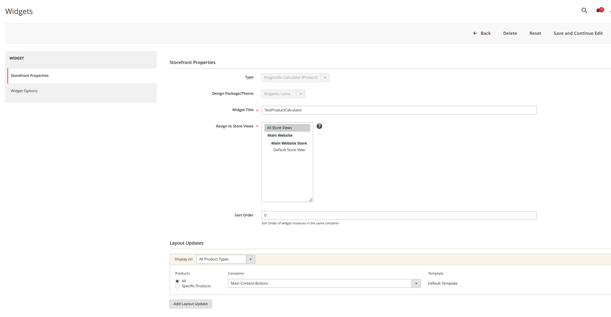

# Moduł Pragma_PragmaPayCalculator

## Opis

Moduł `Pragma_PragmaPayCalculator` dostarcza widgety do wyświetlania kalkulatora PragmaGO w Magento. Widgety te pozwalają sprzedawcom na integrację kalkulatora płatności odroczonych na stronach produktów i koszyka. Moduł wspiera dostosowywanie ustawień widgetów i zapewnia bezproblemową integrację z SDK PragmaGO.

## Szczegóły instalacji

Aby uzyskać informacje na temat instalacji modułu w Magento 2, zobacz [Włączanie lub wyłączanie modułów](https://devdocs.magento.com/guides/v2.4/install-gde/install/cli/install-cli-subcommands-enable.html).

## Rozszerzalność

Deweloperzy rozszerzeń mogą wchodzić w interakcję z modułem `Pragma_PragmaPayCalculator`. Aby uzyskać więcej informacji na temat mechanizmu rozszerzeń Magento, zobacz [Magento plug-ins](https://devdocs.magento.com/guides/v2.4/extension-dev-guide/plugins.html).

[Mechanizm wstrzykiwania zależności Magento](https://devdocs.magento.com/guides/v2.4/extension-dev-guide/depend-inj.html) umożliwia nadpisywanie funkcjonalności modułu `Pragma_PragmaPayCalculator`.

## Widgety

Moduł `Pragma_PragmaPayCalculator` dostarcza następujące widgety:

### 1. Kalkulator PragmaGO (Produkt)

**Opis:**
Wyświetla kalkulator PragmaGO na stronach produktów, używając ceny produktu.

**Ustawienia:**
- **ID Produktu (opcjonalne):** Pozwala określić ID produktu, aby nadpisać domyślny kontekst produktu.
- **Szablon:** Definiuje szablon używany do renderowania widgetu. Domyślny szablon to `product_calculator.phtml`.

**Jak skonfigurować w panelu administracyjnym Magento:**
1. Przejdź do **Zawartość > Widgety** w panelu administracyjnym Magento.
2. Kliknij **Dodaj widget**.
3. Wybierz **Kalkulator PragmaGO (Produkt)** jako typ widgetu.
4. Wybierz odpowiedni **Motyw projektowy** i kliknij **Kontynuuj**.
5. W zakładce **Właściwości widoku sklepu**:
   - Ustaw **Tytuł widgetu**.
   - Przypisz widget do określonych **Widoków sklepu**.
   - Zdefiniuj **Kolejność sortowania**.
6. W zakładce **Opcje widgetu**:
   - Określ **ID Produktu** (opcjonalne).
   - Wybierz **Szablon** (domyślny: `product_calculator.phtml`).
7. Zapisz widget i wyczyść pamięć podręczną.

**Przykładowy obraz:**

---

### 2. Kalkulator PragmaGO (Koszyk)

**Opis:**
Wyświetla kalkulator PragmaGO na stronie koszyka, używając całkowitej wartości koszyka.

**Ustawienia:**
- **Szablon:** Definiuje szablon używany do renderowania widgetu. Domyślny szablon to `cart_calculator.phtml`.

**Jak skonfigurować w panelu administracyjnym Magento:**
1. Przejdź do **Zawartość > Widgety** w panelu administracyjnym Magento.
2. Kliknij **Dodaj widget**.
3. Wybierz **Kalkulator PragmaGO (Koszyk)** jako typ widgetu.
4. Wybierz odpowiedni **Motyw projektowy** i kliknij **Kontynuuj**.
5. W zakładce **Właściwości widoku sklepu**:
   - Ustaw **Tytuł widgetu**.
   - Przypisz widget do określonych **Widoków sklepu**.
   - Zdefiniuj **Kolejność sortowania**.
6. W zakładce **Opcje widgetu**:
   - Wybierz **Szablon** (domyślny: `cart_calculator.phtml`).
7. Zapisz widget i wyczyść pamięć podręczną.

**Przykładowy obraz:**

## Dodatkowe informacje

Aby uzyskać informacje o istotnych zmianach w wydaniach poprawek, zobacz [Informacje o wydaniach](https://devdocs.magento.com/guides/v2.4/release-notes/bk-release-notes.html).
